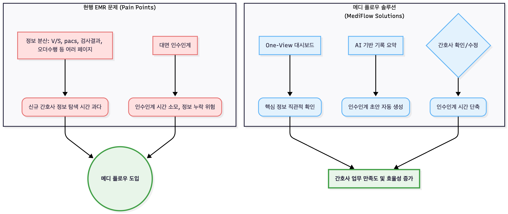

# 프로젝트 개요 (Project Overview)

## 핵심 요약

**MediFlow**는 간호사의 실무 경험을 기반으로 설계된 EMR 시스템입니다. 기존 EMR의 비효율적인 정보 탐색과 인수인계 프로세스를 해결하기 위해 **환자 정보 통합 대시보드**와 **AI 기반 인수인계 자동화**를 핵심 기능으로 구현했습니다.

- **개발 기간**: 7일 (기획 1일 + 개발 4일 + 배포 2일)
- **개발 인원**: 1인 (Full-stack)
- **핵심 가치**: 도메인 전문성을 기술로 전환한 문제 해결

---

## 프로젝트 목표 구조

---

## 프로젝트 배경

### 현장에서 발견한 문제

간호사로 근무하며 경험한 EMR 시스템의 핵심 문제점:

#### 1. 분산된 정보 구조로 인한 시간 낭비
- 환자 한 명의 상태 파악을 위해 **활력징후, I/O, 투약기록, 간호기록, 검사결과** 등 최소 5개 이상의 페이지를 이동해야 함
- 신규 간호사는 정보 위치를 몰라 **환자 상태 파악에 과도한 시간 소요**
- 응급 상황에서 빠른 의사결정에 치명적인 장애 요소

#### 2. 비효율적인 인수인계 프로세스
- 대면 인수인계로 인한 **시간 소모** 및 **정보 누락 위험**
- 간호사가 당일 근무 내용을 수기로 정리하여 구두 전달
- 표준화되지 않은 인수인계 방식으로 일관성 부족

### 기술적 해결 방안

| 문제 영역 | 기존 방식             | 메디 플로우 솔루션 | 기술적 구현 |
|---------|-------------------|----------------|-----------|
| **정보 조회** | 다중 페이지 이동 (5+ 클릭) | One-View 통합 대시보드 | React 컴포넌트 모듈화 + 실시간 데이터 aggregation |
| **인수인계** | 수기 작성 + 구두 전달     | AI 자동 요약 생성 | Gemini API 활용한 의료 기록 요약 파이프라인 |
| **신규 간호사 적응** | 별도 교육 필요          | 직관적 UI/UX | 간호 업무 플로우 기반 정보 아키텍처 설계 |

---

## 도메인 전문성의 기술적 전환

### 간호사 경험 → 데이터 모델링
- **실무 지식**: 환자 상태 파악에 필요한 핵심 데이터 우선순위 파악
- **기술 적용**: 8개 부서별 환자-간호사 배치 로직, ER부서 Triage 레벨 기반 데이터 구조 설계
- **결과**: Patient, Nurse, Department 엔티티 간 다대다 관계 설계로 유연한 배치 관리 구현

### 인수인계 프로세스 이해 → AI 프롬프트 엔지니어링
- **실무 지식**: 인수인계 시 전달되어야 할 필수 정보 항목 정의 (활력징후 변화, 투약 이력, 특이사항 등)
- **기술 적용**: 의료 기록 데이터를 구조화하여 Gemini API에 전달, 간호사 검토 가능한 요약문 생성
- **결과**: AI가 초안 작성 → 간호사 검토/수정 → 저장/공유 파이프라인 구축

### 의료 규정 이해 → 보안 아키텍처 설계
- **실무 지식**: 의료법상 환자 정보 보호 규정 및 AI 활용 제약 사항 인지
- **기술 적용**: OAuth2 인증, 병원 자체 AI 서버 구축 시나리오 문서화
- **결과**: 실서비스 배포 시 고려사항 사전 정리 (→ 문서 8번 항목 참조)

---

## 프로젝트 정보

- **프로젝트 이름**: 메디플로우 (MediFlow)
- **배포 URL**:
    - Frontend: `https://mediflow-emr.cloud`
    - Backend API: `https://api.mediflow-emr.cloud`
    - API 문서: [api 명세서](6.API_DOCUMENTATION.md)
- **참고 문서**:
    - [기능 명세서](3.FEATURES.md)
    - [아키텍처 설계](4.ARCHITECTURE.md)
    - [의료법과 AI](8.LEGAL_COMPLIANCE.md)
    - [향후 업데이트 계획](7.ROADMAP.md)