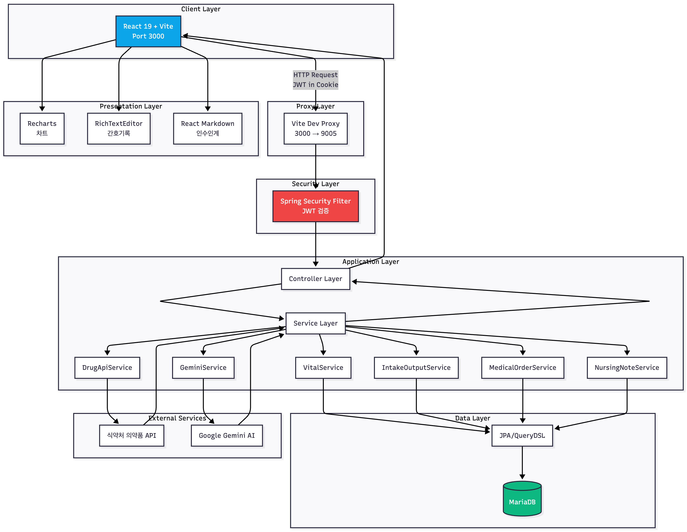

# 기능 명세서 (Feature Specification)

## 핵심 요약

메디플로우는 **Spring Boot 3.5.6 (Java 21)** 기반의 백엔드와 **React 19 + Vite** 기반의 프론트엔드로 구성된 풀스택 EMR 시스템입니다. JWT 인증, MariaDB, Google Gemini AI API 연동을 통해 간호사 업무 자동화를 실현하며, 특히 **AI 기반 인수인계 자동 요약**과 **통합 환자 뷰**로 간호사의 업무 시간을 단축합니다.

---

## 기술 스택 (Tech Stack)

### Frontend

| 기술 (Technology) | 용도 (Usage) |
| :--- | :--- |
|  | UI 컴포넌트 라이브러리 |
|  | 빌드 도구 및 개발 서버 (HMR 지원) |
|  | 클라이언트 사이드 라우팅 |
|  | 경량 상태 관리 |
|  | HTTP 클라이언트 (API 통신) |
|  | 바이탈 사인 시계열 차트 |
|  | 인수인계 마크다운 렌더링 |
|  | 코드 하이라이팅 |


### Backend

| 기술 (Technology) | 용도 (Usage) |
| :--- | :--- |
|  | 프로그래밍 언어 |
|  | 백엔드 프레임워크 |
|  | 인증/인가 (JWT + OAuth2) |
|  | ORM (객체-관계 매핑) |
|  | 타입 안전 동적 쿼리 |
|  | 토큰 기반 인증 |
|  | 이메일 인증 발송 |
|  | 보일러플레이트 코드 자동 생성 |

### Database

| 기술 (Technology) | 용도 (Usage) |
| :--- | :--- |
|  | 운영 데이터베이스 |
|  | 개발/테스트용 인메모리 DB |

### External APIs

| 기술 (Technology) | 용도 (Usage) |
| :--- | :--- |
|  | AI 인수인계 요약 생성 |
|  | 약품 정보 실시간 검색 |
|  | 소셜 로그인 (구글) |
|  | 소셜 로그인 (카카오) |

### Infrastructure

| 기술 (Technology) | 용도 (Usage) |
| :--- | :--- |
|  | 백엔드 서버 호스팅 |
|  | MariaDB 관리형 데이터베이스 |
|  | 정적 파일 저장 (프로필 이미지 등) |
|  | 프론트엔드 CDN |
|  | 도메인 관리 |
|  | CI/CD 파이프라인 |

---

## 시스템 아키텍처


---

## 핵심 기능

### 1. JWT 기반 인증 시스템
```
안전한 사용자 인증 및 세션 관리
```

#### 로컬 이메일 인증 (Local Email Authentication)


#### Google OAuth2 소셜 로그인


#### Kakao OAuth2 소셜 로그인


---

#### 3가지 인증 방식 비교

| 구분 | Local Email    | Google OAuth2             | Kakao OAuth2              |
| :--- |:---------------|:--------------------------|:--------------------------|
| **Provider** | LOCAL          | GOOGLE                    | KAKAO                     |
| **providerId** | 자동 생성 UUID     | Google sub                | Kakao id                  |
| **비밀번호** | BCrypt 암호화 저장  | 없음 (Google 관리)            | 없음 (Kakao 관리)             |
| **이메일 필수** | 필수             | 필수                        |  선택 (placeholder 처리)      |
| **인증 흐름** | 직접 검증          | OAuth2 Authorization Code | OAuth2 Authorization Code |
| **JWT subject** | providerId     | Google sub                | Kakao id                  |
| **토큰 발급** | AuthController | OAuth2SuccessHandler      | OAuth2SuccessHandler      |
| **회원가입** | 명시적 회원가입 필요    | 첫 로그인 시 자동 생성             | 첫 로그인 시 자동 생성             |


#### 주요 보안 특징

*   **HttpOnly 쿠키:** 자바스크립트(`document.cookie`)로 접근이 불가능하여 **XSS(교차 사이트 스크립팅) 공격을 원천 차단**
*   **SameSite 정책:** CSRF(교차 사이트 요청 위조) 공격을 방지하기 위해 쿠키 전송 정책을 설정
*   **Refresh Token:** Access Token(15분) 만료 시, 유효기간이 긴(7일) Refresh Token을 통해 사용자 개입 없이 토큰을 자동 갱신
*   **BCrypt 암호화:** 로컬 로그인 시 비밀번호를 안전한 단방향 해시 알고리즘으로 암호화하여 저장
*   **State 파라미터:** OAuth2 인증 과정에서 난수를 생성 및 검증하여 요청 위조를 방지
*   **providerId 분리:** Local, Google, Kakao 등 각 Provider별 고유 식별자를 사용하여 사용자 데이터 충돌을 방지

---

### 2. 통합 환자 뷰 - 바이탈 사인 & I/O 관리
```
환자 정보를 한 화면에서 확인하고 바이탈 사인 및 섭취배설량을 간편하게 입력
```

#### 


---

### 3. 의료 오더 조회 & 식약처 API 약품 정보
```
의사 처방 오더를 조회하고, 식약처 API를 통해 약품 정보를 실시간으로 확인
```

#### 


#### 식약처 API 연동 데이터

| 필드 | 내용 |
|-----|------|
| **약품명** | itemName |
| **제조사** | entpName |
| **효능·효과** | efcyQesitm |
| **사용법** | useMethodQesitm |
| **주의사항 경고** | atpnWarnQesitm |
| **주의사항** | atpnQesitm |
| **상호작용** | intrcQesitm |
| **부작용** | seQesitm |
| **보관방법** | depositMethodQesitm |

---

### 4. 리치 텍스트 에디터 간호기록
```
형광펜, 글자색, 서식을 활용한 직관적인 간호기록 작성
```

#### 


---

### 5. AI 기반 인수인계 자동 요약 
```
Google Gemini AI를 활용하여 당일 간호 기록을 자동 요약, 인수인계 시간 단축
```

####


#### AI 요약 결과 예시
```markdown
## 응급실 DAY → EVENING 인수인계

### 홍길동 (P2024001, 45세/남)
- **주요 변화**: 혈압 145/95로 정상 범위 초과, 지속 모니터링 필요
- **수행한 처치**: 타이레놀 500mg PO 2회, 항생제 1g IV 투여 완료
- **지속 관찰 사항**: 
  - 혈압 경향성 체크
  - WBC 12000으로 감염 의심, 추가 검사 결과 확인 필요
- **특이사항**: 환자 상태 양호, 통증 호소 없음
```

---

## 기술적 의사결정

### 1. React 19 + Vite 선택 이유

- **Vite**: Webpack 대비 10배 빠른 HMR (Hot Module Replacement)
- **React 19**: 최신 Concurrent Features, Automatic Batching
- **개발 생산성**: 빠른 빌드 속도로 7일 개발 가능

### 2. QueryDSL 도입 배경
```java
// JPQL - 컴파일 타임 오류 감지 불가
String jpql = "SELECT p FROM Patient p WHERE p.department.id = :deptId";

// QueryDSL - 타입 안전, IDE 자동완성
JPAQueryFactory queryFactory;
List<Patient> patients = queryFactory
    .selectFrom(patient)
    .where(patient.department.id.eq(deptId))
    .fetch();
```

- 복잡한 조인 쿼리 (환자-간호사-근무조-부서)를 타입 안전하게 작성
- 컴파일 시점에 오류 발견

### 3. JWT + HttpOnly Cookie

| 방식 | 장점 | 단점 |
|-----|------|------|
| **LocalStorage** | 간편한 구현 | XSS 공격에 취약 |
| **HttpOnly Cookie** | XSS 방어 가능 | CSRF 대응 필요 |

- **선택**: HttpOnly Cookie + SameSite 속성
- **이유**: 의료 데이터 보안이 최우선

### 4. MariaDB vs PostgreSQL

- **선택**: MariaDB
- **이유**:
    - AWS RDS 프리티어 지원
    - 한국어 풀텍스트 검색 필요 없음 (간호기록은 짧은 텍스트)
    - Spring Boot JPA와 호환성 우수

---

## 성능 최적화

### 1. N+1 쿼리 문제 해결

**문제:**
```java
// 환자 10명 조회 → 1번 쿼리
List<Patient> patients = patientRepository.findAll();

// 각 환자의 바이탈 조회 → 10번 쿼리 (N+1 문제)
for (Patient p : patients) {
    VitalSign vital = vitalRepository.findLatestByPatientId(p.getId());
}
```

**해결:**
```java
// LEFT JOIN FETCH로 1번 쿼리로 해결
List<Patient> patients = queryFactory
    .selectFrom(patient)
    .leftJoin(patient.vitalSigns, vitalSign).fetchJoin()
    .where(patient.department.id.eq(deptId))
    .fetch();
```

### 2. 인덱스 설계
```sql
-- 환자 조회 최적화
CREATE INDEX idx_patient_department ON patient(department_id, is_admitted);

-- 바이탈 조회 최적화
CREATE INDEX idx_vital_patient_time ON vital_sign(patient_id, measured_at DESC);

-- 간호기록 조회 최적화
CREATE INDEX idx_nursing_note_patient ON nursing_note(patient_id, created_at DESC);
```

---

## 보안 고려사항

### 1. 의료 데이터 접근 제어
```java
@PreAuthorize("hasRole('NURSE')")
public List<Patient> getMyPatients(@AuthenticationPrincipal User user) {
    // 현재 간호사에게 배정된 환자만 조회
    return patientService.getAssignedPatients(user.getId());
}
```

### 2. API 요청 검증
```java
@PostMapping("/vitals")
public ResponseEntity<VitalSign> createVital(
    @Valid @RequestBody VitalSignRequest request) {
    // @Valid로 필드 유효성 자동 검증
    // 혈압: 50-250 / 30-150
    // 심박수: 30-250
    // 체온: 35.0-42.0
    // SpO2: 70-100
}
```

### 3. CORS 설정
```java
@Configuration
public class WebConfig implements WebMvcConfigurer {
    @Override
    public void addCorsMappings(CorsRegistry registry) {
        registry.addMapping("/api/**")
            .allowedOrigins("https://mediflow-emr.cloud")
            .allowedMethods("GET", "POST", "PUT", "PATCH", "DELETE")
            .allowCredentials(true); // Cookie 전송 허용
    }
}
```

---

## UI/UX 설계 원칙

### 1. 간호사 업무 플로우 기반 설계
```
대시보드 → 담당 환자 목록 (이상 징후 우선 표시)
  ↓
환자 선택 → One-View (모든 탭이 한 화면에 명확히 표시)
  ↓
원하는 탭 1번 클릭 → 즉시 정보 접근
  ↓
데이터 입력/수정 → 실시간 저장
  ↓
근무 종료 → AI 인수인계 자동 생성 (1번 클릭)
```

### 2. 색상 코딩

| 색상 | 의미 | 적용 |
|-----|------|------|
| **빨강** | 위험/이상 | 혈압 140/90 초과, SpO2 95% 미만 |
| **노랑** | 주의 | I/O 불균형 (500mL 이상 차이) |
| **초록** | 정상 | 정상 범위 바이탈 |
| **파랑** | 정보 | 일반 간호기록 |

### 3. 반응형 디자인

- 데스크톱(1920px), 태블릿(1024px), 모바일(768px) 대응
- 간호사 업무 특성상 데스크톱 우선 설계

---


## 향후 확장 계획

| 기능 | 우선순위 | 예상 기간 |
|-----|---------|-------|
| **수간호사용 자동 근무표** | High | 2주    |
| **신규 간호사 온보딩 챗봇** | High | 1주    |
| **EMR 가이드 검색** | Medium | 1주    |
| **WebSocket 실시간 알림** | Medium | 1주    |
| **의료 영상 뷰어 연동** | Low | 3주    |

---

## 참고 자료

- [Spring Boot 공식 문서](https://spring.io/projects/spring-boot)
- [React 19 Release Notes](https://react.dev/blog/2024/12/05/react-19)
- [Google Gemini API 문서](https://ai.google.dev/docs)
- [식약처 의약품 API](https://www.data.go.kr/data/15075057/openapi.do)
- [JWT Best Practices](https://datatracker.ietf.org/doc/html/rfc8725)