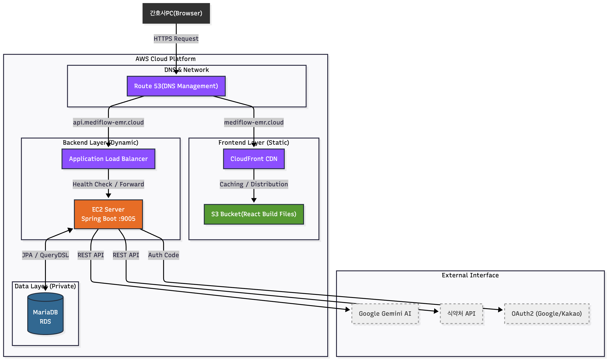
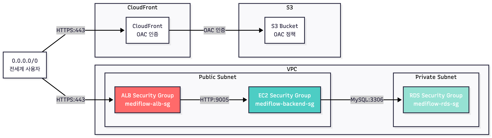
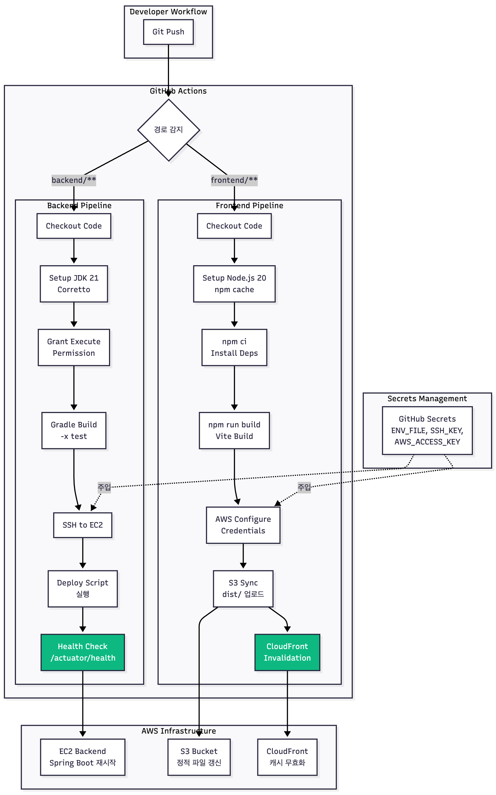
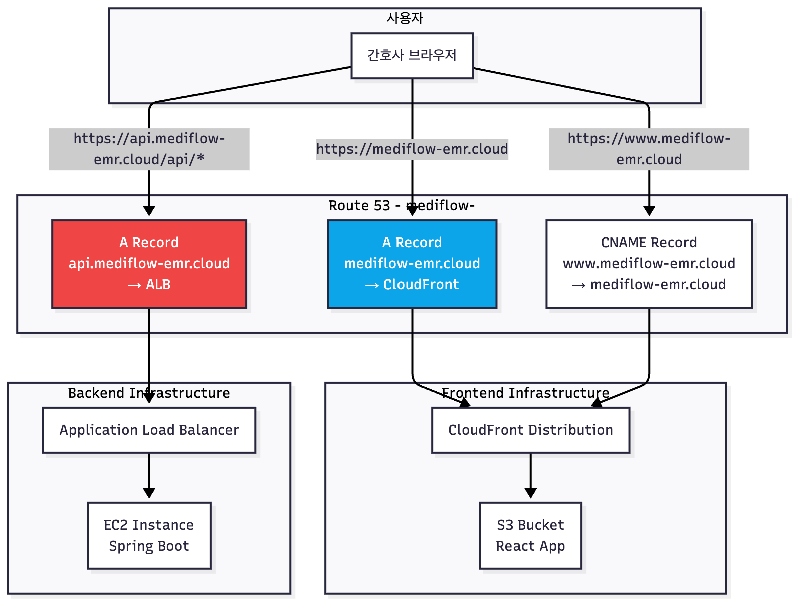
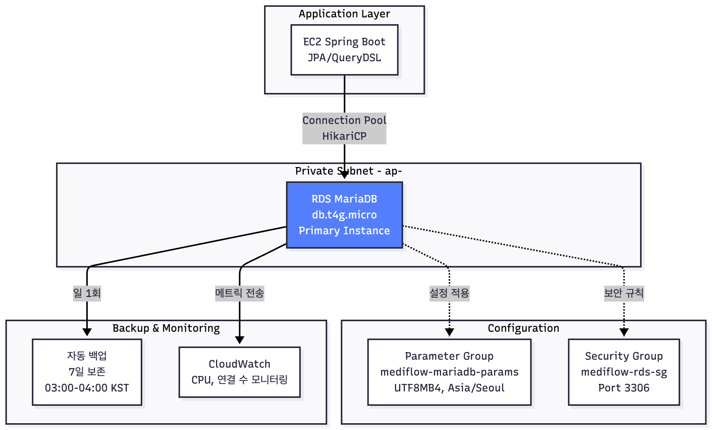

# 아키텍처 (Architecture)

## 핵심 요약

메디플로우는 **AWS 기반 3-Tier 아키텍처**로 구축되었습니다. 프론트엔드는 S3 + CloudFront CDN으로 전 세계 빠른 접근을 보장하고, 백엔드는 EC2 + ALB로 트래픽을 분산 처리하며, RDS MariaDB로 데이터를 안전하게 관리합니다. GitHub Actions를 통한 CI/CD 자동화로 코드 푸시 후 5분 내 배포가 완료됩니다.

**핵심 기술 결정:**
- **도메인 분리**: `mediflow-emr.cloud` (프론트엔드) / `api.mediflow-emr.cloud` (백엔드)
- **보안**: OAC, HTTPS 강제, 보안 그룹 최소 권한 원칙

---

## 전체 시스템 아키텍처

### 메인 시스템 아키텍처 (Runtime)
```
사용자가 서비스를 이용할 때의 흐름
```

---

## 네트워크 및 보안 아키텍처

### 보안 그룹 관계도


### 보안 그룹 규칙 상세

| 보안 그룹 | 인바운드 규칙 | 소스 | 목적 |
|---------|------------|------|------|
| **mediflow-alb-sg** | HTTPS (443) | 0.0.0.0/0 | 전세계 사용자 접근 |
| **mediflow-alb-sg** | HTTP (80) | 0.0.0.0/0 | HTTPS 리다이렉션용 |
| **mediflow-backend-sg** | HTTP (9005) | mediflow-alb-sg | ALB → EC2 전달 |
| **mediflow-backend-sg** | SSH (22) | 내 IP | 관리자 접속 |
| **mediflow-rds-sg** | MySQL (3306) | mediflow-backend-sg | EC2 → RDS 연결 |
| **mediflow-rds-sg** | MySQL (3306) | 내 IP | 로컬 개발/관리 |

---

## CI/CD 파이프라인

### GitHub Actions 워크플로우 아키텍처


---

## 도메인 아키텍처

### 도메인 분리 전략


### 왜 도메인을 분리했는가?

| 항목 | 프론트엔드 | 백엔드 |
|-----|-----------|--------|
| **도메인** | `mediflow-emr.cloud` | `api.mediflow-emr.cloud` |
| **인프라** | CloudFront + S3 | ALB + EC2 |
| **인증서 리전** | **us-east-1** (CloudFront 요구사항) | **ap-northeast-2** (서울) |
| **배포 방식** | GitHub Actions → S3 Sync | GitHub Actions → SSH Deploy |
| **캐싱** | CloudFront Edge 캐시 | 캐싱 없음 (동적 API) | 

**기술적 이유:**
1. **인증서 리전 충돌**: CloudFront는 반드시 us-east-1 인증서 필요, ALB는 서울 리전 인증서 필요
2. **독립적 배포**: 프론트엔드 변경 시 백엔드 재시작 불필요
3. **보안 분리**: API 엔드포인트를 명확히 구분하여 CORS 정책 적용
4. **확장성**: 향후 모바일 앱, 관리자 페이지 등 추가 시 서브도메인으로 분리 가능

---

## 데이터베이스 아키텍처

### RDS 구성


### 주요 설정

| 항목 | 값 | 선택 이유 |
|-----|---|---------|
| **인스턴스 클래스** | db.t4g.micro | t4g가 t3 대비 20% 저렴, ARM 기반 성능 우수 |
| **스토리지** | 20GB gp3 | gp2 대비 20% 저렴, IOPS 3000 기본 제공 |
| **엔진** | MariaDB 10.11 | MySQL 호환, 오픈소스, Spring Boot JPA 최적화 |
| **파라미터 그룹** | UTF8MB4 | 한글 + 이모지 지원 |
| **타임존** | Asia/Seoul | KST 시간대 자동 처리 |
| **백업 보존** | 7일 | 주간 단위 롤백 가능 |

---

## 트러블슈팅 가이드

### 1. 504 Gateway Timeout (ALB → EC2)

**증상:** API 요청 시 504 오류

**원인 체크리스트:**
```bash
# 1. EC2에서 Spring Boot 실행 중인지 확인
ps aux | grep java

# 2. 9005 포트 리스닝 확인
netstat -tlnp | grep 9005

# 3. Health Check 엔드포인트 테스트
curl http://localhost:9005/actuator/health

# 4. 보안 그룹 9005 포트 열림 확인
aws ec2 describe-security-groups --group-ids sg-xxx
```

**해결:**
- EC2 보안 그룹 인바운드에 9005 포트 추가
- 소스: `mediflow-alb-sg` 또는 ALB IP 대역

### 2. 401 Unauthorized (Health Check)

**증상:** ALB Target Group이 Unhealthy (401)

**원인:** SecurityConfig가 `/actuator/health` 차단

**해결:**
```java
// SecurityConfig.java
.requestMatchers("/actuator/health").permitAll();
```

### 3. CORS 에러

**증상:** 브라우저 콘솔에 CORS 에러

**원인 체크리스트:**
```java
// 1. SecurityConfig CORS 설정 확인
configuration.setAllowedOriginPatterns(Arrays.asList(
    "https://mediflow-emr.cloud",
    "https://www.mediflow-emr.cloud"
));

// 2. 쿠키 전송 허용 확인
configuration.setAllowCredentials(true);
```
```javascript
// 3. 프론트엔드 axios 설정 확인
const apiClient = axios.create({
  baseURL: 'https://api.mediflow-emr.cloud',
  withCredentials: true, // 중요!
});
```

### 4. OAuth 리디렉션 실패

**증상:** 소셜 로그인 후 localhost로 이동

**원인:** Google/Kakao 콘솔 Redirect URI 미등록

**해결:**
1. Google Cloud Console → Redirect URI 추가:
```
   https://api.mediflow-emr.cloud/login/oauth2/code/google
```

2. Kakao Developers → Redirect URI 추가:
```
   https://api.mediflow-emr.cloud/login/oauth2/code/kakao
```

### 5. CloudFront 캐시 문제

**증상:** 배포 후에도 이전 파일이 보임

**해결:**
```bash
# CloudFront 캐시 무효화
aws cloudfront create-invalidation \
  --distribution-id E1234ABCD \
  --paths "/*"
```

---

## 롤백 전략

### Backend 롤백
```bash
# 1. EC2 접속
ssh -i ~/Downloads/mediflow-backend.pem ec2-user@EC2_IP

# 2. 이전 커밋으로 되돌리기
cd ~/mediflow-emr
git log --oneline
git checkout <commit-hash>

# 3. 재배포
cd backend
./gradlew clean build -x test
pkill -f mediflow
nohup java -jar -Dspring.profiles.active=prod build/libs/*.jar > app.log 2>&1 &
```

### Frontend 롤백
```bash
# 1. 로컬에서 이전 커밋으로 이동
git checkout <commit-hash>

# 2. 재빌드 및 배포
cd frontend
npm run build
aws s3 sync dist/ s3://mediflow-emr-frontend --delete

# 3. CloudFront 캐시 무효화
aws cloudfront create-invalidation \
  --distribution-id E1234ABCD \
  --paths "/*"
```

---