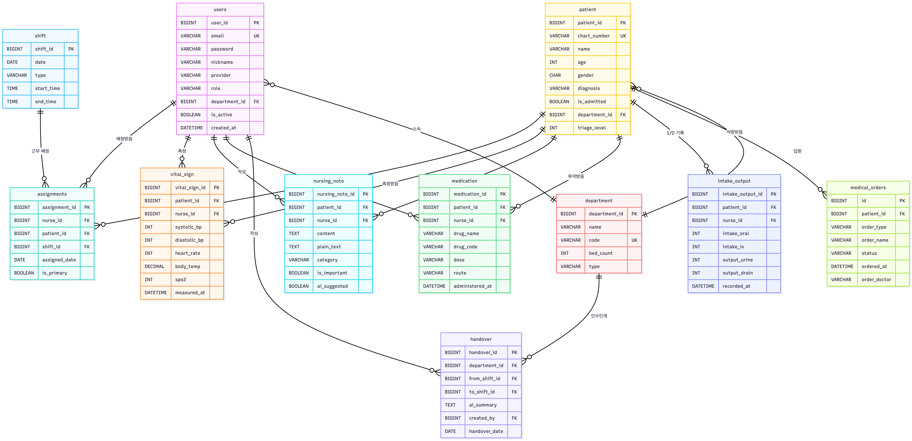
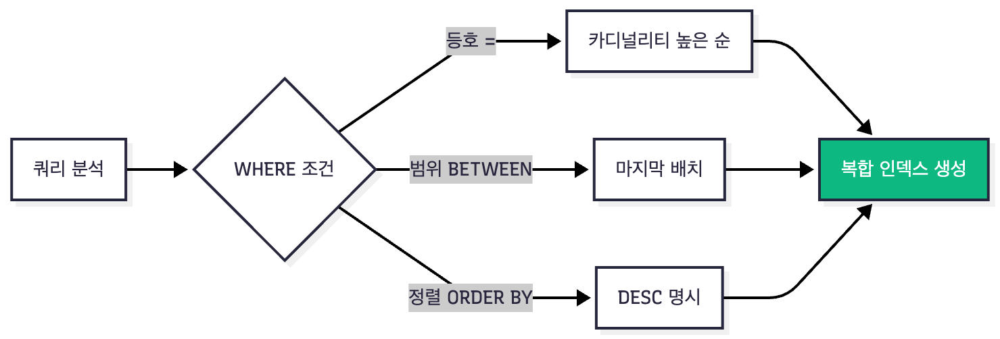
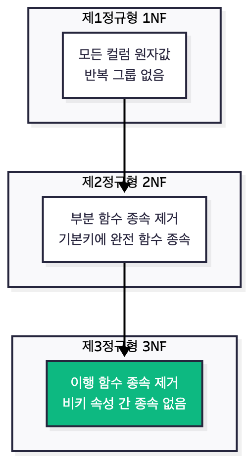

# 데이터베이스 설계 (Database Design)

## 핵심 요약

메디플로우는 **MariaDB 10.11** 기반 14개 테이블로 환자·간호기록·활력징후·인수인계 등 핵심 의료 도메인을 **3NF로 정규화**했으며, 주요 조회 패턴에 최적화된 **복합 인덱스**를 적용해 **시계열 조회**와 **Full-Text Search**를 지원합니다. **UTF8MB4**로 한글·이모지를 완전 지원하고, 간호 기록은 **화면 표시용 HTML**과 **AI 분석용 Plain Text**를 이중 저장해 Gemini API에 전달하며, **JPA/QueryDSL** 기반 ORM으로 데이터에 접근합니다.

**기술 스택:**
- DBMS: MariaDB 10.11
- ORM: JPA/Hibernate + QueryDSL
- 스토리지: 20GB gp3 (AWS RDS) 

---

## ERD (Entity Relationship Diagram)

### 전체 ERD


---

## 테이블 구조 및 설계 원칙

### 테이블 분류


---

## 주요 테이블 상세

### 1. users (사용자)

**용도:** 간호사, 의사, 관리자 정보 관리

| 컬럼 | 타입 | 제약 | 설명 |
|-----|------|------|------|
| user_id | BIGINT | PK, AUTO_INCREMENT | 사용자 ID |
| email | VARCHAR(255) | UK, NOT NULL | 로그인 이메일 |
| password | VARCHAR(500) | NULL | BCrypt 암호화 (OAuth는 NULL) |
| nickname | VARCHAR(100) | NOT NULL | 화면 표시용 닉네임 |
| provider | VARCHAR(30) | NOT NULL | GOOGLE/KAKAO/LOCAL |
| provider_id | VARCHAR(255) | NOT NULL | OAuth 제공자 ID |
| role | VARCHAR(20) | NOT NULL | USER/NURSE/DOCTOR/ADMIN |
| department_id | BIGINT | FK | 소속 부서 |
| is_active | BOOLEAN | DEFAULT TRUE | 활성화 여부 |
| is_locked | BOOLEAN | DEFAULT FALSE | 계정 잠금 |
| created_at | DATETIME | AUTO | 생성일시 |

**인덱스:**
```sql
CREATE INDEX idx_user_email ON users(email);
CREATE INDEX idx_user_provider ON users(provider, provider_id);
CREATE INDEX idx_user_dept_role ON users(department_id, role, is_active);
```

---

### 2. vital_sign (바이탈 사인)

**용도:** 활력징후 측정 기록

| 컬럼 | 타입 | 제약 | 정상 범위 |
|-----|------|------|----------|
| vital_sign_id | BIGINT | PK | - |
| patient_id | BIGINT | FK, NOT NULL | - |
| nurse_id | BIGINT | FK, NOT NULL | - |
| systolic_bp | INT | CHECK | 50-250 mmHg |
| diastolic_bp | INT | CHECK | 30-150 mmHg |
| heart_rate | INT | CHECK | 30-250 bpm |
| body_temp | DECIMAL(4,1) | CHECK | 35.0-42.0 °C |
| spo2 | INT | CHECK | 70-100 % |
| measured_at | DATETIME | NOT NULL | - |

**핵심 인덱스:**
```sql
-- 환자별 시계열 조회
CREATE INDEX idx_vital_patient_time ON vital_sign(
    patient_id, 
    measured_at DESC,
    systolic_bp,
    diastolic_bp,
    spo2
);
```

---

### 3. nursing_note (간호기록)

**용도:** 리치 텍스트 에디터 기반 간호 기록

| 컬럼 | 타입 | 설명 |
|-----|------|------|
| nursing_note_id | BIGINT PK | 기록 ID |
| patient_id | BIGINT FK | 환자 ID |
| nurse_id | BIGINT FK | 작성 간호사 |
| content | TEXT | HTML 형식 (형광펜, 글자색 포함) |
| plain_text | TEXT | Plain Text (AI 분석용) |
| category | VARCHAR(20) | OBSERVATION/TREATMENT/MEDICATION |
| is_important | BOOLEAN | 중요 표시  |
| ai_suggested | BOOLEAN | AI 제안 여부 |

**Full-Text Search:**
```sql
CREATE FULLTEXT INDEX ft_note_plain ON nursing_note(plain_text);
```

---

### 4. handover (인수인계)

**용도:** AI 기반 근무조 간 인수인계

| 컬럼 | 타입 | 설명 |
|-----|------|------|
| handover_id | BIGINT PK | 인수인계 ID |
| department_id | BIGINT FK | 부서 |
| from_shift_id | BIGINT FK | 인계 근무조 (DAY) |
| to_shift_id | BIGINT FK | 인수 근무조 (EVENING) |
| handover_date | DATE | 인수인계 날짜 |
| ai_summary | TEXT | Gemini AI 요약 |
| created_by | BIGINT FK | 작성자 |

---

## 데이터 타입 선택 전략

### 선택 기준

| 용도 | 선택 | 이유 |
|-----|------|------|
| **Primary Key** | BIGINT | 21억 초과 대비 |
| **이메일, 이름** | VARCHAR(255) | 길이 예측 가능, 인덱스 효율 |
| **간호기록** | TEXT | 길이 예측 불가 (최대 65KB) |
| **측정값** | INT | 정수로 충분 |
| **날짜+시간** | DATETIME | 타임존 설정 (Asia/Seoul) |

---

## 인덱스 설계 전략

### 복합 인덱스 순서 원칙


**올바른 예시:**
```sql
-- 등호 조건 앞, 범위 조건 뒤
CREATE INDEX idx_vital_good ON vital_sign(
    patient_id,           -- WHERE patient_id = ?
    measured_at DESC      -- ORDER BY measured_at DESC
);

-- 잘못된 순서
CREATE INDEX idx_vital_bad ON vital_sign(
    measured_at,          -- 범위가 앞에 오면
    patient_id            -- 뒤 컬럼 사용 불가
);
```
---

## 제약 조건 (Constraints)

### 데이터 무결성 보장


---

## 정규화 vs 비정규화

### 정규화 수준


### 의도적 비정규화 사례

| 항목 | 정규화 방법 | 비정규화 선택 | 이유 |
|-----|-----------|------------|------|
| **patient.allergies** | allergies 테이블 분리 | VARCHAR(500) 쉼표 구분 | 자주 변경 안 됨, JOIN 비용 절감 |
| **intake_output 총량** | intake_total 컬럼 추가 | 저장 안 함, 계산으로 처리 | 데이터 불일치 방지, 계산 간단 |

---