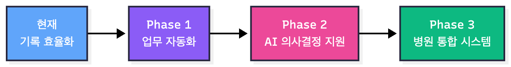
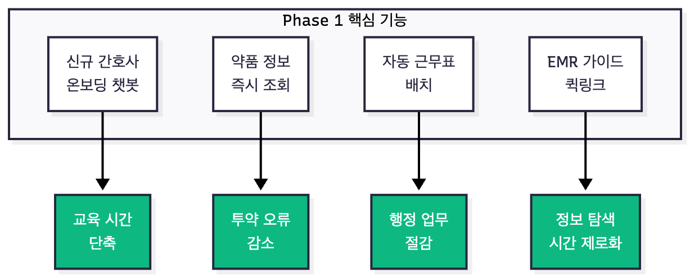
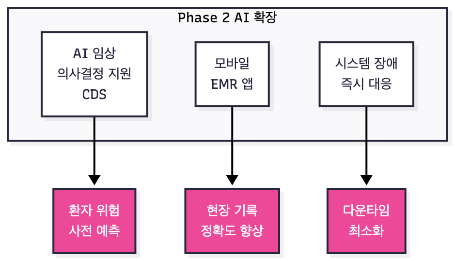
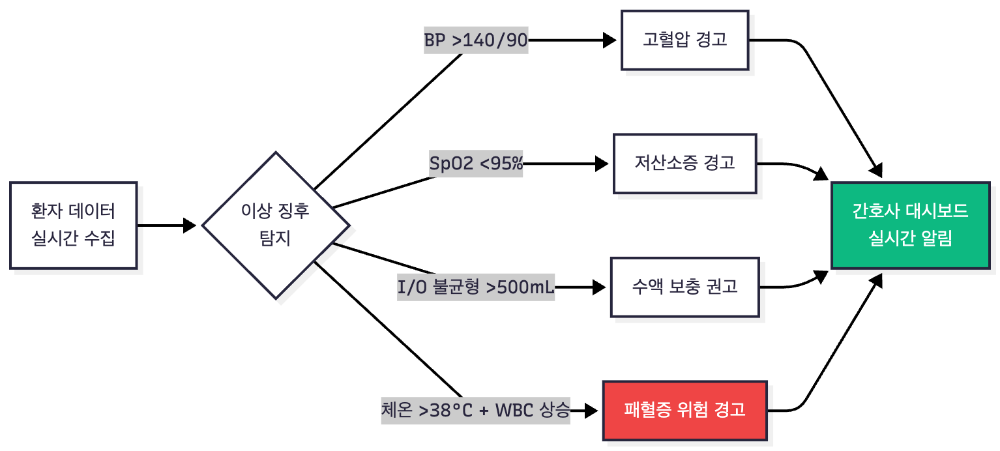
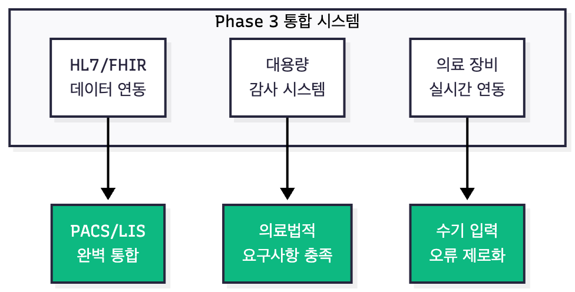
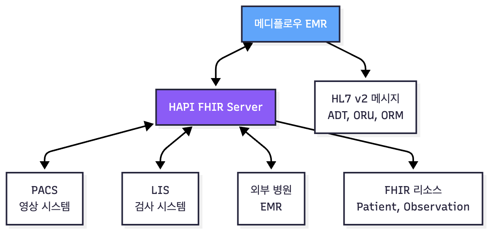

# 향후 업데이트 계획 (Future Roadmap)

## 비전 (Vision)

메디플로우는 단순 기록 도구를 넘어 **AI 기반 간호 인력 지원 플랫폼**으로 발전하며, 간호사의 **업무 효율**과 환자 **안전**을 동시에 극대화하는 것을 목표로 합니다.

---

## 3단계 확장 로드맵

---

## Phase 1. 간호사 현장 업무 효율화 

**목표:** 사용자의 즉각적인 불편 해소 및 업무 시간 단축

### 주요 기능 상세

| 기능 | 구현 방법 | 효과                              |
|-----|----------|---------------------------------|
| **신규 간호사 온보딩 챗봇** | 기존 ChatHistory 엔티티 + Gemini API 활용하여 EMR 사용법, 병원 정책, 기록 기준 안내 | **교육시간 단축**, 신규 간호사 현장 투입 속도 향상 |
| **약품 정보 즉시 조회** | 식약처 API 연동, 약품명 입력 시 효능·용법·주의사항 팝업 표시 | **투약 오류 감소**, 환자 안전성 향상         |
| **자동 근무표 배치 (수간호사용)** | AI 기반 스케줄링 (경력, 환자 중증도, 휴가 고려) | **수간호사 행정 업무 절감**, 근무 배치 공정성 확보 |
| **EMR 가이드 퀵링크** | "투약 기록 어디 봐요?" → 해당 탭으로 즉시 이동 | **정보 탐색 시간 제로화**, 업무 연속성 확보     |

## Phase 2. AI 기반 관리 자동화 및 CDS 확장 

**목표:** AI 역할 확장 - 기록 요약 → 관리 및 의사결정 지원

### 주요 기능 상세

| 기능 | 구현 방법 | 효과                            |
|-----|----------|-------------------------------|
| **AI 임상 의사결정 지원 (CDS)** | 바이탈·I/O·검사결과 시계열 분석 → 패혈증 위험, 수액 보충 필요 등 경고 | 환자 위험 상황 **조기 감지**, 간호사 판단 지원 |
| **모바일 EMR 앱** | React Native/Flutter 기반 네이티브 앱, 환자 바코드 스캔 후 현장 기록 | **기록 정확도 향상**, 업무 공간 제약 해소    |
| **시스템 장애 즉시 대응** | EMR 오류 발생 시 IT 부서로 로그 자동 전송, Slack/Email 알림 | 다운타임 **감소**, 진료 연속성 확보        |

### AI CDS 알고리즘 예시

---

## Phase 3. 표준화 및 외부 시스템 통합

**목표:** 대형 병원 환경에 필요한 확장성 및 표준화 확보

### 주요 기능 상세

| 기능 | 구현 방법 | 효과 |
|-----|----------|------|
| **HL7/FHIR 기반 데이터 연동** | HAPI FHIR 서버 구축, HL7 v2 메시지 파싱 모듈 개발 | PACS(영상), LIS(검사) 시스템과 완벽 통합 |
| **대용량 감사(Audit) 시스템** | ELK Stack (Elasticsearch, Logstash, Kibana) 구축, 모든 기록 변경 이력 추적 | 의료법적 요구사항 충족, 보안 감사 완벽 대응 |
| **의료 장비 실시간 연동** | Bedside Monitor → EMR 자동 전송 인터페이스 (HL7 ORU 메시지) | 수기 입력 오류 **100% 제거**, 간호사 기록 시간 절감 |

### HL7/FHIR 통합 아키텍처

---