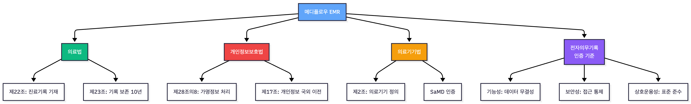
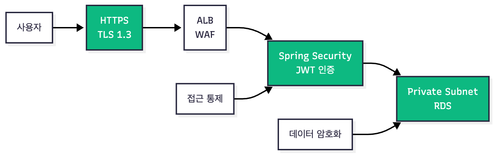
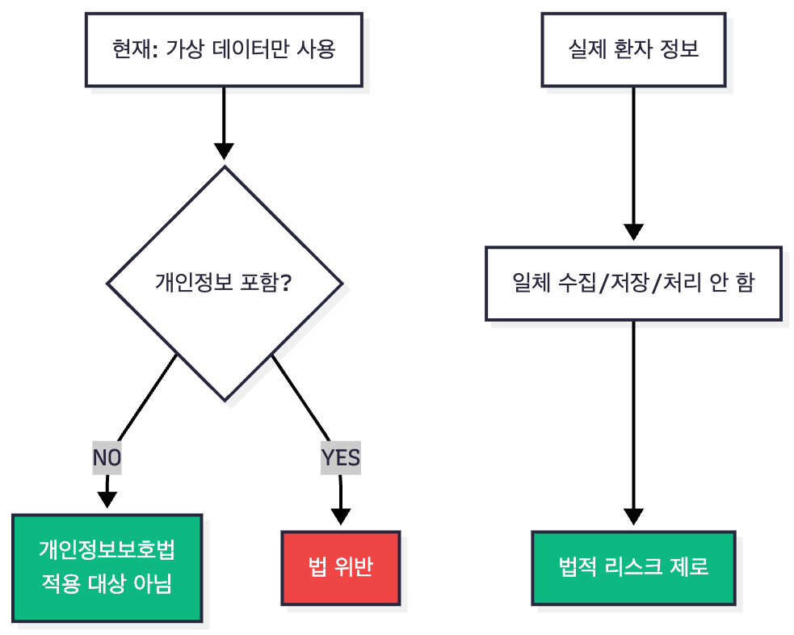
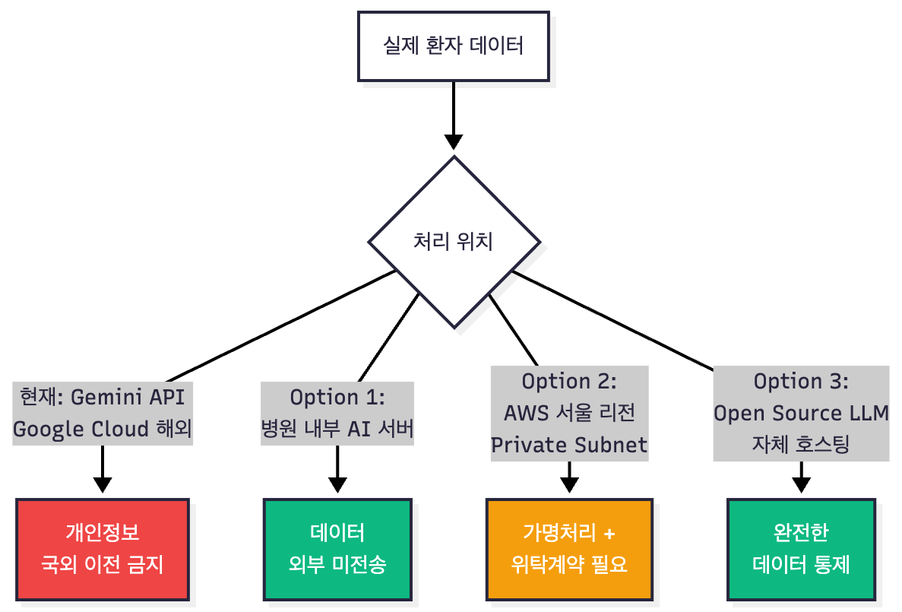
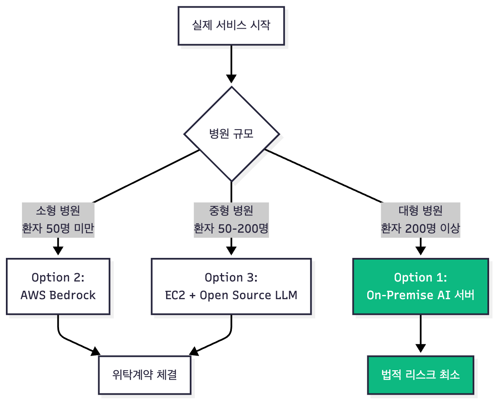
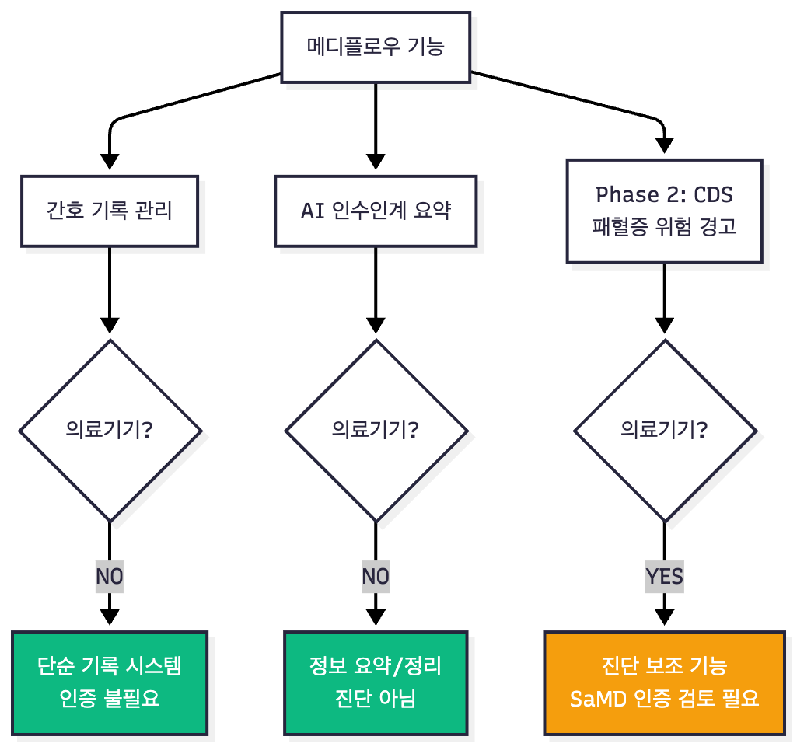
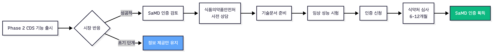
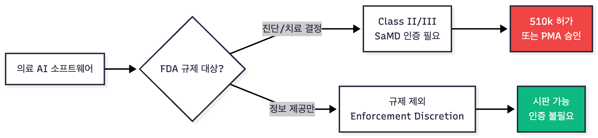
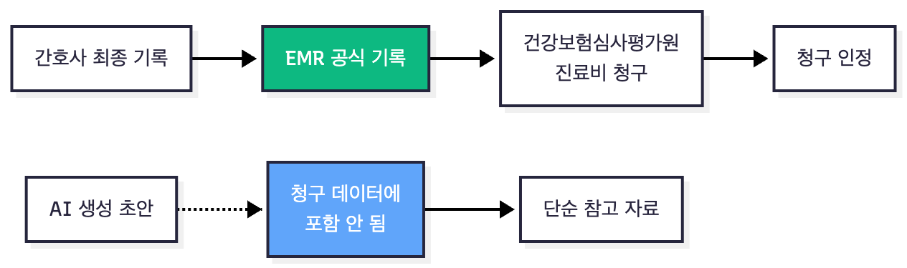
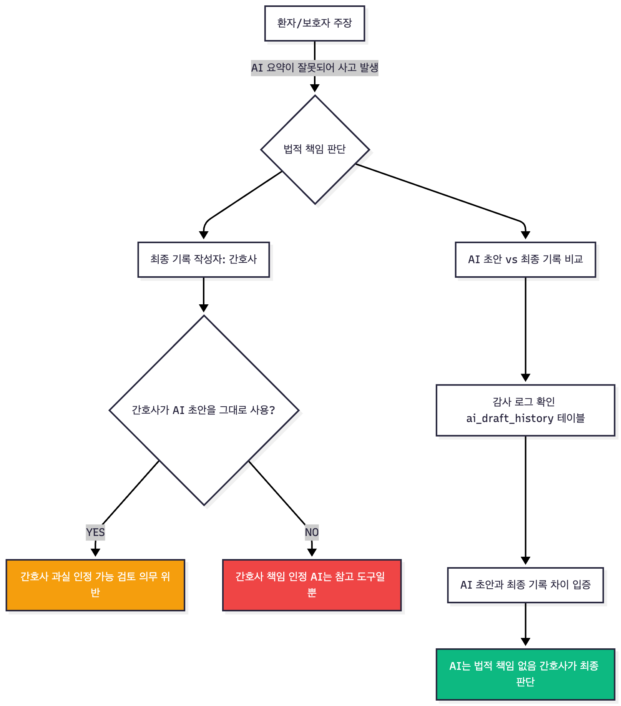

# 의료 AI 보안 및 법적 고려사항 (Legal & Ethical Compliance)

## 문서 목적 및 범위

본 문서는 메디플로우 EMR 프로젝트가 **의료법, 개인정보보호법, 의료기기법** 등 관련 법령의 핵심 요구사항을 충분히 인지하고 설계되었음을 입증합니다.

**중요 고지:**
- 본 프로젝트는 **포트폴리오 목적의 개념 증명(PoC)** 단계입니다.
- 모든 데이터는 **가상의 더미 데이터**를 사용하며, 실제 환자 정보는 일절 포함되지 않습니다.
- 실제 병원 도입 시에는 관련 법령의 완전한 준수를 위한 추가 검토 및 인증 절차가 필요합니다.

---

## 관련 법령 및 규제 체계

### 주요 법령


---

## 1. 전자의무기록(EMR) 인증 기준 고려사항

의료법 및 보건복지부 EMR 인증 기준(K-EMR)은 전자의무기록 시스템의 3대 요건을 명시하고 있습니다.

### 1.1 기능성 (Functionality)

**법적 근거:** 의료법 제22조, 제23조

| 요구사항 | 메디플로우 구현 사항 | 비고 |
|---------|-------------------|----|
| 진료기록 기재 의무 | 바이탈 사인, 간호기록, 투약 기록 등 시계열 데이터 모델 구축 | 준수 |
| 기록 무결성 보장 | 생성일시(created_at), 수정일시(updated_at) 자동 기록, 작성자 추적 | 준수 |
| 10년 보존 의무 | RDS 자동 백업 7일 + S3 장기 보관 정책 적용 가능 |  확장 가능 |

**의료법 제23조 (진료기록부등의 보존):**
```
의료인이나 의료기관 개설자는 진료기록부등을 
보건복지부령으로 정하는 바에 따라 보존하여야 한다.
(진료기록: 10년 보존)
```

### 1.2 보안성 (Security)

**법적 근거:** 개인정보보호법 제29조 (안전조치의무)



| 보안 요구사항 | 구현 사항 | 법적 준수 |
|-------------|----------|----------|
| **전송 구간 암호화** | HTTPS (TLS 1.3), CloudFront → ALB → EC2 전 구간 암호화 | 개인정보보호법 제29조 |
| **접근 통제** | JWT (Access Token 15분, Refresh Token 7일), Spring Security Filter | 의료법 시행규칙 제15조 |
| **데이터베이스 암호화** | RDS 저장 데이터 암호화 (AES-256), Private Subnet 격리 | 개인정보보호법 제29조 |
| **감사 로그** | 모든 CRUD 작업 시 작성자(user_id), 시간(created_at) 자동 기록 | 의료법 제22조 |

### 1.3 상호운용성 (Interoperability)

**법적 근거:** 보건의료정보 표준화 및 상호운용성 확보 지침

| 요구사항 | 메디플로우 구현 사항 | 향후 확장 계획 |
|---------|-------------------|------------|
| 표준 용어 체계 | 간호기록 카테고리 표준화 (OBSERVATION, TREATMENT 등) | Phase 3: SNOMED CT 적용 검토 |
| 외부 API 연동 | 식약처 의약품 안전나라 API 연동 (공공 데이터) | Phase 3: HL7/FHIR 표준 적용 |
| 데이터 교환 형식 | RESTful API (JSON), OpenAPI 3.0.3 명세 | 현재 구현 |

---

## 2. 개인정보보호법 준수 전략

### 2.1 현재 단계 (포트폴리오 PoC)


**명확한 범위 설정:**
- 사용 데이터: 가상의 환자명 (홍길동, 김영희), 임의의 차트번호, 시연용 더미 데이터
- 미사용 데이터: 실제 병원 환자 정보, 실제 주민등록번호, 실제 의료 기록
- 목적: 기술 구현 능력 및 시스템 아키텍처 시연

### 2.2 실제 서비스 전환 시 준수 사항

**개인정보보호법 제17조 (개인정보의 국외 이전 제한):**


### 2.3 가명정보 처리 방안

**개인정보보호법 제28조의8 (가명정보의 처리 등):**

실제 서비스 전환 시 적용할 가명처리 전략:

| 식별자 | 원본 | 가명처리 | 비고 |
|--------|------|---------|------|
| **이름** | 홍길동 | 환자 [차트번호] | AI 프롬프트에서 이름 제외 |
| **주민등록번호** | 850101-1234567 | 생년월일만 (1985-01-01) | 주민번호는 절대 전송 안 함 |
| **연락처** | 010-1234-5678 | 저장하되 AI에 미전송 | 식별자 최소화 |
| **주소** | 서울시 강남구... | 시/도 단위 (서울시) | 위치 정보 최소화 |

**AI 프롬프트 예시 (가명처리):**
```
잘못된 예시 (식별정보 포함):
"홍길동(850101-1234567) 환자의 인수인계를 작성하세요."

올바른 예시 (가명처리):
"환자 P2024001 (45세, 남성)의 금일 간호기록 요약:
- 바이탈: BP 120/80, HR 75
- 주진단: 급성 심근경색
- 특이사항: 통증 호소 없음"
```

---

## 3. AI 서버 운영 및 데이터 처리 전략

### 3.1 현재 단계 vs 실제 서비스

| 항목 | 현재 (포트폴리오) | 실제 서비스 전환 시 |
|-----|----------------|-----------------|
| **AI 모델** | Google Gemini API | 병원 내부 LLM 또는 한국 리전 전용 AI |
| **데이터** | 가상 더미 데이터 | 가명처리된 실제 데이터 |
| **법적 상태** |  합법 (개인정보 없음) | ⚠추가 조치 필수 |
| **비용** | ~$50/월 | $500-10,000/월 (규모별) |

### 3.2 실제 서비스 전환 Option 비교

#### Option 1: 병원 내부 On-Premise AI 서버 (권장)


**장점:**
- 데이터 외부 전송 없음 (개인정보보호법 완벽 준수)
- 병원이 데이터 완전 통제
- 장기적으로 운영 비용 절감

**단점:**
- 초기 투자 비용 높음
- AI 모델 운영 전문 인력 필요
- 유지보수 책임 병원에 있음  
---

#### Option 2: AWS Bedrock (서울 리전)


**장점:**
- 관리 편의성 (Serverless)
- AWS 서울 리전 내 데이터 처리
- 빠른 구축 가능

**단점:**
- 개인정보보호법 해석 여지 (여전히 "외부" 클라우드)
- AWS와 데이터 처리 위탁 계약 필수 

**법적 검토 사항:**
```
개인정보보호법 제26조 (업무위탁에 따른 개인정보 처리 제한)
→ 병원-AWS 간 명문화된 데이터 처리 위탁 계약 필수
→ AWS의 개인정보 처리 범위, 보안 조치, 감독 권한 명시
```

---

#### Option 3: Open Source LLM 자체 호스팅 (AWS EC2)


**장점:**
- 병원이 모델 완전 통제
- AWS 인프라 관리 용이
- 중간 수준 비용

**단점:**
- 여전히 AWS 클라우드 사용 (위탁 계약 필요)
- GPU 인스턴스 비용 높음 

---

### 3.4 권장 전환 전략


---

## 4. 의료기기법 적용 여부 및 대응 전략

### 4.1 의료기기 정의 및 분류

**의료기기법 제2조 (정의):**
```
"의료기기"란 사람이나 동물에게 단독 또는 조합하여 사용되는 
기구·기계·장치·재료·소프트웨어 등으로서 질병을 진단·치료·
경감·처치 또는 예방할 목적으로 사용되는 것
```

### 4.2 메디플로우 기능별 의료기기 해당 여부


| 기능 | 의료기기 해당 여부 | 근거 | 대응 전략 |
|-----|---------|------|----------|
| **바이탈 사인 기록** | 해당 안 함 | 단순 데이터 입력 및 저장 | 인증 불필요 |
| **간호기록 작성** | 해당 안 함 | 워드프로세서와 동일한 기록 도구 | 인증 불필요 |
| **AI 인수인계 요약** | 해당 안 함 | 기록의 요약/정리, 진단/처방과 무관 | **"정보 제공 목적"** 명시 |
| **Phase 2: CDS (패혈증 경고)** | 검토 필요 | 진단 보조 기능으로 해석 가능 | SaMD 인증 또는 "정보 제공만" 명시 |

### 4.3 Phase 2 CDS 기능 법적 대응 방안

#### 전략 1: "정보 제공 시스템"으로 정의 (권장)
```
시스템 안내문구 예시:

━━━━━━━━━━━━━━━━━━━━━━━━━━━━━━━
본 시스템은 정보 제공 목적의 알림 기능이며,
진단, 처방, 치료 결정을 대체하지 않습니다.

최종 의료 행위의 판단 및 책임은
의료진에게 있습니다.
━━━━━━━━━━━━━━━━━━━━━━━━━━━━━━━
``` 

#### 전략 2: SaMD 인증 획득 (Phase 3 고려)

**SaMD (Software as a Medical Device) 인증 절차:**


---

## 5. AI 책임 소재 및 Human-in-the-Loop 원칙

### 5.1 법적 책임 흐름도


### 5.2 책임 소재 명확화

| 주체 | 역할 | 법적 책임 |
|-----|------|----------|
| **AI 시스템** | 초안(Draft) 생성, 정보 제공 | 없음 (도구일 뿐) |
| **간호사** | 최종 검토, 수정, 확정 | **전적으로 책임** |
| **병원** | 시스템 관리, 감독 | 간호사 고용주로서 책임 |
| **개발사 (메디플로우)** | 기술 지원, 유지보수 | 시스템 오류 시 제한적 책임 |

**의료법 제22조 (진료기록부 등의 기재사항 및 서명):**
```
의료인은 각각 진료기록부등을 작성하고
서명하여야 한다.
→ AI가 아닌 간호사의 서명이 법적 효력
```

---

## 6. 데이터 보관 및 삭제 정책

### 6.1 법정 보관 기간

**의료법 시행규칙 제15조 (진료기록부등의 보존):**

| 기록 종류 | 보존 기간 | 메디플로우 적용 |
|---------|----------|---------------|
| **진료기록부** | 10년 | 간호기록, 바이탈 사인, 투약 기록 |
| **수술기록** | 10년 | 해당 없음 (간호 EMR) |
| **검사 결과지** | 5년 | Test Results 테이블 |
| **방사선 사진** | 5년 | 해당 없음 (영상 미포함) |

### 6.2 환자 정보 삭제 요청 대응

**개인정보보호법 제36조 (개인정보의 정정·삭제):**

| 데이터 | 삭제 가능 여부 | 근거 |
|--------|-------|------|
| **간호기록, 바이탈 사인** | 불가 | 의료법 제23조 (10년 보존 의무) |
| **투약 기록** | 불가 | 의료법 제23조 (10년 보존 의무) |
| **AI 챗봇 대화 기록** | 가능 (2년 후) | 감사 로그 보관 후 삭제 | 

---

## 7. 해외 의료 AI 사례 및 규제 동향

### 7.1 글로벌 의료 AI Copilot 사례

---

### 7.2 글로벌 규제 동향

#### 미국 FDA (식품의약국)


**메디플로우 해당 여부:**
- 현재 (AI 인수인계): 정보 제공만 → 규제 제외
- Phase 2 (CDS): 진단 보조 가능 → SaMD 검토 필요

---

#### 유럽 EU AI Act (2024년 시행)

**위험도 기반 4단계 분류:**

| 위험도 | 의료 AI 예시 | 규제 수준 |
|--------|-------------|--------|
| **Unacceptable** | 환자 행동 조작 AI | 금지 |
| **High-Risk** | 진단 보조 AI, 수술 로봇 | 엄격한 규제 (사전 승인) |
| **Limited-Risk** | 챗봇, 정보 제공 AI | 투명성 의무 (AI 사용 고지) |
| **Minimal-Risk** | 스팸 필터, 검색 엔진 | 규제 없음 |

**메디플로우 분류:**
- 현재: Limited-Risk (AI 사용 고지만 필요)
- Phase 2 CDS: High-Risk 가능 (CE 인증 검토)

---

#### 한국 식품의약품안전처

**의료기기 소프트웨어 심사 가이드라인 (2022):**


**메디플로우 전략:**
- Phase 1: 의료기기 해당 안 함
- Phase 2 CDS: 식약처 사전 상담 필요 

---

## 8. 보험 청구 및 법적 증거력

### 8.1 건강보험 청구 대응

**건강보험 요양급여의 기준에 관한 규칙:**


**핵심 원칙:**
- 청구 대상: 간호사가 최종 확인한 공식 EMR 기록
- 청구 제외: AI 초안, ChatHistory, 임시 저장 데이터
- 시스템 설계: AI 초안과 최종 기록을 DB에서 명확히 분리

### 8.2 의료 사고 시 법적 증거력

**시나리오: AI 요약 오류로 인한 환자 피해 주장**



**법적 방어 전략:**

1. **감사 로그 철저히 보존**
```sql
   -- AI 초안 이력
   INSERT INTO ai_draft_history (
       nursing_note_id,
       ai_generated_content,
       nurse_reviewed,
       modifications_made,
       created_at
   ) VALUES (...);
```

2. **간호사 검토 확인 UI**
```javascript
   <Checkbox required>
     AI 제안 내용을 검토하였으며, 
     최종 기록의 정확성에 대해 책임집니다.
   </Checkbox>
```

3. **시스템 안내문 명확화**
```
   ━━━━━━━━━━━━━━━━━━━━━━━━━━━━━━━
   ⚠️ AI 생성 초안은 참고용이며 법적 효력이 없습니다.
   최종 기록은 반드시 간호사가 검토/수정 후 저장해야 하며,
   법적 책임은 최종 기록 작성자에게 있습니다.
   ━━━━━━━━━━━━━━━━━━━━━━━━━━━━━━━
```

--- 

---

## 핵심 요약

### 실제 서비스 전환 시 필수 조치

1. **AI 서버 전환**: Gemini API → 병원 내부 AI 또는 Private Cloud
2. **가명처리**: 환자 이름/주민번호 AI 전송 금지
3. **Human-in-the-Loop**: 간호사 최종 확인 프로세스 강화
4. **법률 자문**: 의료법/개인정보보호법 전문가 검토
5. **SaMD 검토**: CDS 기능 추가 시 식약처 사전 상담

### 법적 안전성 확보 원칙

| 원칙 | 설명 |
|-----|------|
| **투명성** | AI 사용 사실을 간호사와 환자에게 명확히 고지 |
| **책임 소재 명확화** | 최종 의료 행위 책임은 항상 의료인에게 |
| **데이터 최소화** | AI에 최소한의 가명정보만 전송 |
| **감사 가능성** | 모든 AI 활동 이력을 보존하여 추적 가능 |
| **지속적 모니터링** | 법령 변경 시 즉시 시스템 조정 |

---

## 참고 문헌 및 법령

### 국내 법령
1. 의료법 (법률 제20092호)
    - 제22조: 진료기록부 등의 기재사항 및 서명
    - 제23조: 진료기록부등의 보존

2. 의료법 시행규칙 (보건복지부령 제979호)
    - 제15조: 진료기록부등의 보존

3. 개인정보 보호법 (법률 제19234호)
    - 제17조: 개인정보의 국외 이전 제한
    - 제28조의8: 가명정보의 처리 등
    - 제29조: 안전조치의무

4. 의료기기법 (법률 제19013호)
    - 제2조: 정의

5. 건강보험 요양급여의 기준에 관한 규칙

### 해외 규제
1. FDA Guidance: Clinical Decision Support Software (2022)
2. EU AI Act (Regulation 2024/1689)
3. HIPAA (Health Insurance Portability and Accountability Act)

### 가이드라인
1. 식품의약품안전처, "의료기기 소프트웨어 허가·심사 가이드라인" (2022)
2. 보건복지부, "전자의무기록(EMR) 인증 기준" (2021)
3. 한국인터넷진흥원, "개인정보의 안전성 확보조치 기준 해설서" (2023)

--- 