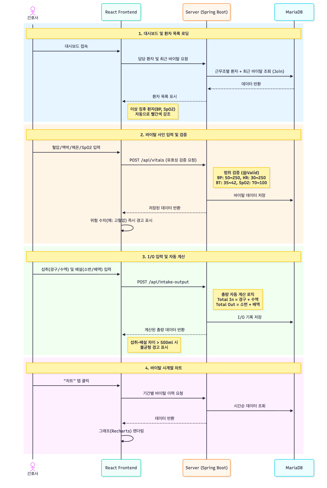
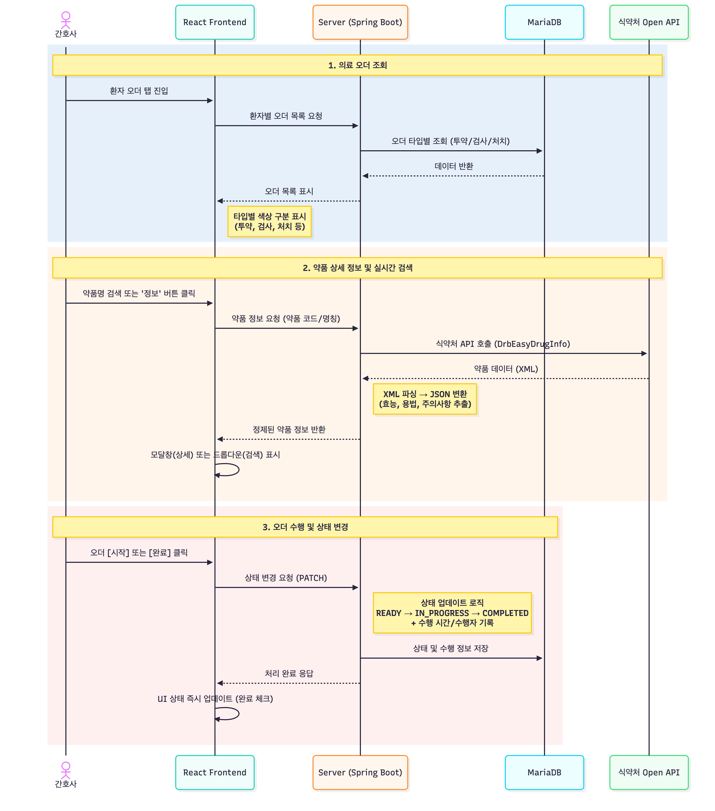
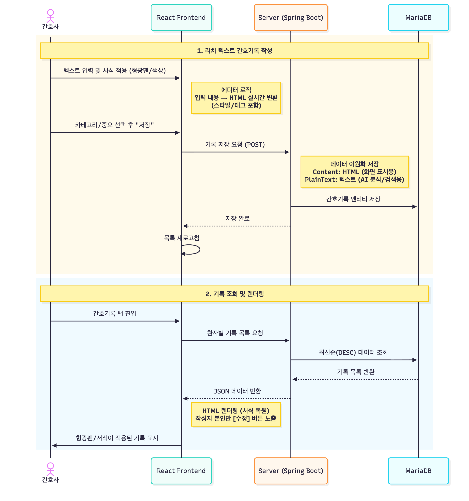
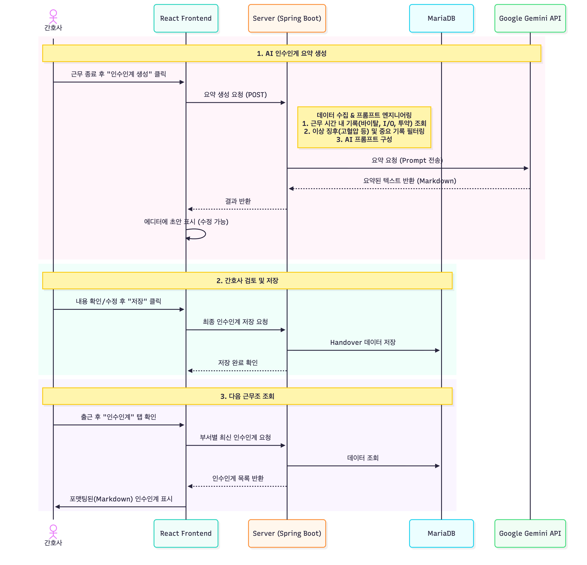

# MediFlow EMR

> 간호사의 실무 경험을 기반으로 설계된 차세대 전자의무기록 시스템

**MediFlow**는 간호사의 업무 효율을 극대화하기 위해 **환자 정보 통합 대시보드**와 **AI 기반 인수인계 자동화**를 핵심으로 구현한 EMR 시스템입니다.

 
[](https://spring.io/projects/spring-boot)
[](https://react.dev)
[](https://mariadb.org)
[](https://aws.amazon.com)

---

## 프로젝트 개요

### 프로젝트 목표 구조


### 핵심 문제 인식

간호사로 근무하며 경험한 EMR 시스템의 핵심 문제점:

#### 1. 분산된 정보 구조로 인한 시간 낭비
- 환자 한 명의 상태 파악을 위해 **최소 5개 이상의 페이지**를 이동해야 함
- 신규 간호사는 정보 위치를 몰라 **환자 상태 파악에 과도한 시간 소요**
- 응급 상황에서 빠른 의사결정에 치명적인 장애

#### 2. 비효율적인 인수인계 프로세스
- 대면 인수인계로 인한 **시간 소모** 및 **정보 누락 위험**
- 간호사가 당일 근무 내용을 수기로 정리하여 구두 전달
- 표준화되지 않은 인수인계 방식으로 일관성 부족

### 기술적 해결 방안

| 문제 영역 | 기존 방식 | MediFlow 솔루션 | 기술적 구현 |
|---------|----------|----------------|-----------|
| **정보 조회** | 다중 페이지 이동 (5+ 클릭) | One-View 통합 대시보드 | React 컴포넌트 모듈화 + 실시간 데이터 aggregation |
| **인수인계** | 수기 작성 + 구두 전달 | AI 자동 요약 생성 | Gemini API 활용한 의료 기록 요약 파이프라인 |
| **신규 간호사 적응** | 별도 교육 필요 | 직관적 UI/UX | 간호 업무 플로우 기반 정보 아키텍처 설계 |

### 프로젝트 정보

- **개발 기간**: 7일 (기획 1일 + 개발 4일 + 배포 2일)
- **개발 인원**: 1인 (Full-stack)
- **배포 URL**:
  - Frontend: `https://mediflow-emr.cloud`
  - Backend API: `https://api.mediflow-emr.cloud`

---

## 핵심 기능

### 1. 통합 환자 뷰 - 바이탈 사인 & I/O 관리

환자 정보를 한 화면에서 확인하고 바이탈 사인 및 섭취배설량을 간편하게 입력



**기존 EMR 방식:**
```
환자 클릭 → 어디에 뭐가 있는지 모름 → 여러 메뉴 클릭하며 탐색
→ 활력징후 찾음 → I/O 어디있지? → pacs? → 간호기록은?
```

**MediFlow 방식:**
```
환자 이름 클릭 → 활력징후·I/O·검사결과·오더조회·투약·간호기록 탭이 한 화면에 정렬
→ 원하는 탭만 클릭 (1번 클릭으로 즉시 접근)
```

### 2. 의료 오더 조회 & 식약처 API 약품 정보

의사 처방 오더를 조회하고, 식약처 API를 통해 약품 정보를 실시간으로 확인



### 3. 리치 텍스트 에디터 간호기록

형광펜, 글자색, 서식을 활용한 직관적인 간호기록 작성



### 4. AI 기반 인수인계 자동 요약

Google Gemini AI를 활용하여 당일 간호 기록을 자동 요약, 인수인계 시간 단축



**AI 요약 결과 예시:**
```markdown
## 응급실 DAY → EVENING 인수인계

### 홍길동 (P2024001, 45세/남)
- **주요 변화**: 혈압 145/95로 정상 범위 초과, 지속 모니터링 필요
- **수행한 처치**: 타이레놀 500mg PO 2회, 항생제 1g IV 투여 완료
- **지속 관찰 사항**: 
  - 혈압 경향성 체크
  - WBC 12000으로 감염 의심, 추가 검사 결과 확인 필요
- **특이사항**: 환자 상태 양호, 통증 호소 없음
```

---

## 시스템 아키텍처

### 전체 시스템 아키텍처 (Runtime)


MediFlow는 **AWS 기반 3-Tier 아키텍처**로 구축되었습니다:

- **프론트엔드**: S3 + CloudFront CDN으로 전 세계 빠른 접근 보장
- **백엔드**: EC2 + ALB로 트래픽 분산 처리
- **데이터베이스**: RDS MariaDB로 데이터 안전 관리

### 도메인 분리 전략


| 항목 | 프론트엔드 | 백엔드 |
|-----|-----------|--------|
| **도메인** | `mediflow-emr.cloud` | `api.mediflow-emr.cloud` |
| **인프라** | CloudFront + S3 | ALB + EC2 |
| **인증서 리전** | **us-east-1** (CloudFront 요구사항) | **ap-northeast-2** (서울) |
| **배포 방식** | GitHub Actions → S3 Sync | GitHub Actions → SSH Deploy |

### 네트워크 및 보안 아키텍처


**보안 그룹 규칙:**

| 보안 그룹 | 인바운드 규칙 | 소스 | 목적 |
|---------|------------|------|------|
| **mediflow-alb-sg** | HTTPS (443) | 0.0.0.0/0 | 전세계 사용자 접근 |
| **mediflow-backend-sg** | HTTP (9005) | mediflow-alb-sg | ALB → EC2 전달 |
| **mediflow-rds-sg** | MySQL (3306) | mediflow-backend-sg | EC2 → RDS 연결 |

### CI/CD 파이프라인


GitHub Actions를 통한 자동화로 코드 푸시 후 **5분 내 배포 완료**

---

## 데이터베이스 설계

### ERD (Entity Relationship Diagram)


### 테이블 구조


### 인덱스 설계 전략


**복합 인덱스 순서 원칙:**
```sql
-- 올바른 예시: 등호 조건 앞, 범위 조건 뒤
CREATE INDEX idx_vital_good ON vital_sign(
    patient_id,           -- WHERE patient_id = ?
    measured_at DESC      -- ORDER BY measured_at DESC
);
```

### 데이터 무결성 보장


### 정규화 수준


---

## 기술 스택

### Frontend

| 기술 | 버전 | 용도 |
|-----|------|------|
|  | 19.1.1 | UI 컴포넌트 라이브러리 |
|  | 7.1.2 | 빌드 도구 (HMR 지원) |
|  | 5.0.8 | 경량 상태 관리 |
|  | 1.13.2 | HTTP 클라이언트 |
|  | 3.5.0 | 바이탈 사인 시계열 차트 |

### Backend

| 기술 | 버전 | 용도 |
|-----|------|------|
|  | 21 | 프로그래밍 언어 |
|  | 3.5.6 | 백엔드 프레임워크 |
|  | - | 인증/인가 (JWT + OAuth2) |
|  | 5.0.0 | 타입 안전 동적 쿼리 |
|  | 0.12.3 | 토큰 기반 인증 |

### Database

| 기술 | 버전 | 용도 |
|-----|------|------|
|  | 10.11 | 운영 데이터베이스 |
|  | - | 개발/테스트용 인메모리 DB |

### External APIs

| 기술 | 용도 |
|-----|------|
|  | AI 인수인계 요약 생성 |
|  | 약품 정보 실시간 검색 |
|  | 소셜 로그인 (구글) |
|  | 소셜 로그인 (카카오) |

### Infrastructure

| 기술 | 용도 |
|-----|------|
|  | 백엔드 서버 호스팅 |
|  | MariaDB 관리형 데이터베이스 |
|  | 정적 파일 저장 |
|  | 프론트엔드 CDN |
|  | CI/CD 파이프라인 |

---

## API 문서

### API 도메인 구조


### 주요 엔드포인트

| 도메인 | 엔드포인트 | 설명 |
|--------|-----------|------|
| **Dashboard** | `GET /api/dashboard/my-patients` | 내 담당 환자 목록 조회 |
| **Vital Signs** | `POST /api/vitals` | 바이탈 사인 등록 |
| **Nursing Notes** | `POST /api/nursing-notes` | 간호기록 등록 |
| **Medications** | `GET /api/medications/drugs/search` | 약품 검색 (식약처 API) |
| **Handovers** | `POST /api/handovers/ai-summary` | AI 인수인계 요약 생성 |

### API 문서 확인 방법

1. **[Swagger Editor](https://editor.swagger.io)** 접속
2. 왼쪽 편집기에 **[swagger.yaml](https://github.com/MediFlow-EMR/mediflow-dev/blob/main/swagger.yaml)** 파일 내용 복사 & 붙여넣기
3. 오른쪽에서 실시간으로 API 문서 확인 및 테스트

---

## 보안 및 인증

### JWT 토큰 구조


**이중 토큰 전략:**
- **Access Token**: 15분 (짧은 유효기간으로 보안 강화)
- **Refresh Token**: 7일 (자동 갱신으로 사용자 편의성 확보)

### 3가지 인증 방식

#### 1. 로컬 이메일 인증


#### 2. Google OAuth2


#### 3. Kakao OAuth2


### 주요 보안 특징

- **HttpOnly 쿠키**: XSS 공격 원천 차단
- **SameSite 정책**: CSRF 공격 방지
- **BCrypt 암호화**: 비밀번호 안전 저장
- **State 파라미터**: OAuth2 요청 위조 방지
- **providerId 분리**: 사용자 데이터 충돌 방지

---

## 배포 아키텍처

### RDS 구성


| 항목 | 값 | 선택 이유 |
|-----|---|---------|
| **인스턴스 클래스** | db.t4g.micro | t4g가 t3 대비 20% 저렴, ARM 기반 성능 우수 |
| **스토리지** | 20GB gp3 | gp2 대비 20% 저렴, IOPS 3000 기본 제공 |
| **엔진** | MariaDB 10.11 | MySQL 호환, 오픈소스, Spring Boot JPA 최적화 |
| **타임존** | Asia/Seoul | KST 시간대 자동 처리 |
| **백업 보존** | 7일 | 주간 단위 롤백 가능 |

---

## 법적 고려사항

### 관련 법령 및 규제 체계


### 현재 단계 (포트폴리오 PoC)


**명확한 범위 설정:**
- 사용 데이터: 가상의 환자명 (홍길동, 김영희), 임의의 차트번호, 시연용 더미 데이터
- 미사용 데이터: 실제 병원 환자 정보, 실제 주민등록번호, 실제 의료 기록
- 목적: 기술 구현 능력 및 시스템 아키텍처 시연

### 실제 서비스 전환 시 고려사항

#### 개인정보보호법 준수


#### AI 서버 운영 전략

**Option 1: 병원 내부 On-Premise AI 서버 (권장)**


**Option 2: AWS Bedrock (서울 리전)**


**Option 3: Open Source LLM 자체 호스팅**


#### 권장 전환 전략


### 의료기기법 적용 여부


### AI 책임 소재


---

## 향후 계획

### 3단계 확장 로드맵


### Phase 1. 간호사 현장 업무 효율화


### Phase 2. AI 기반 관리 자동화 및 CDS 확장


#### AI CDS 알고리즘 예시


### Phase 3. 표준화 및 외부 시스템 통합


#### HL7/FHIR 통합 아키텍처


---

## 참고 문서

- [1. 프로젝트 개요](1.PROJECT_OVERVIEW.md)
- [2. 경쟁사 분석](2.COMPETITOR_ANALYSIS.md)
- [3. 기능 명세서](3.FEATURES.md)
- [4. 아키텍처 설계](4.ARCHITECTURE.md)
- [5. 데이터베이스 설계](5.DATABASE_DESIGN.md)
- [6. API 문서](6.API_DOCUMENTATION.md)
- [7. 향후 업데이트 계획](7.ROADMAP.md)
- [8. 법적 고려사항](8.LEGAL_COMPLIANCE.md)

---
